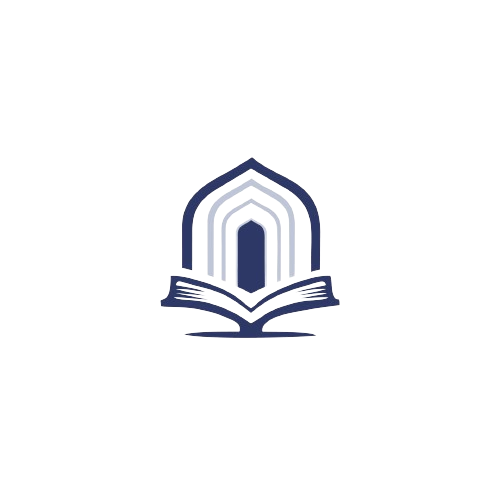

<h1>Islamic Landing Page</h1>
Welcome! I chose Islam theme as the basis of my Odin Landing Page project. 
 
 

<h2> Materials Used</h2> 
<h3>Logo Islamic Mosque and Quran Logo</h3>

 
Description: A modern navy Islamic mosque and Quran logo in flat style, isolated on a white background.
 
Source: <a href="https://www.vecteezy.com/vector-art/35283992-modern-navy-islamic-mosque-and-quran-logo-flat-style-isolated-on-white-background-vector-illustration">Vecteezy Favicon</a>

 
 

<h3>Desert Icon</h3>

 

Description: An icon depicting a desert landscape. Used for the favicon.
 
Source: <a href="https://www.flaticon.com/free-icons/desert" title="desert icons">Desert icons created by Icon Pond - Flaticon</a>

<h3>Mosque Image near the water</h3>
</img>

Description: A beautiful image of a mosque situated near a body of water.
 
Photographer: Oziel Gómez
 
Source: <a href="https://www.pexels.com/photo/mosque-near-the-body-of-water-7529416/">Pexels</a>

 
<h3>Quran Icon</h3>

Description: An icon representing the Quran.
 
Designer: Bigis Gis
 
Source: <a href="https://iconscout.com/icons/quran" class="text-underline font-size-sm" target="_blank">Quran</a> by <a href="https://iconscout.com/contributors/blackonion02" class="text-underline font-size-sm" target="_blank">Bigis Gis</a>

<h3>TV Icon</h3>
               
Description: An icon depicting a television set.
 
Designer: Senoa Studio
 
Source: <a href="https://iconscout.com/icons/tv" class="text-underline font-size-sm" target="_blank">tv</a> by <a href="https://iconscout.com/contributors/ihdizein" class="text-underline font-size-sm" target="_blank">senoa studio</a> 
 
 

About
This landing page is crafted to provide users with an immersive experience into the Islamic culture. From the serene mosque image to the symbolic Quran icon, every element is thoughtfully chosen to reflect the essence of Islamic values.

Feel free to explore and utilize this landing page for your projects, events, or educational purposes. We hope it serves as a gateway to understanding and appreciating the rich heritage of Islam.

How to Use
To incorporate this Islamic-themed landing page into your project:

Clone or download the repository.
 
`git clone https://www.github.com/Llll0l0l/qaswa.git `    
Customize the content to suit your needs. 
Ensure proper attribution to the original sources of the materials used.
Deploy the landing page on your preferred hosting platform.

<h3>License</h3>

This project is licensed under the MIT License, allowing for both personal and commercial use with proper attribution.
  

Disclaimer:  This landing page is created for educational and informational purposes only. All materials used are credited to their respective owners.
